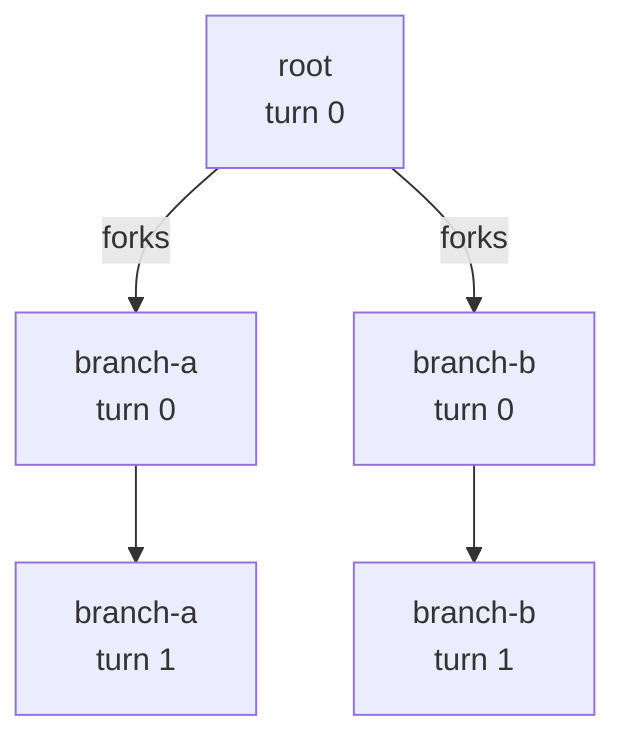
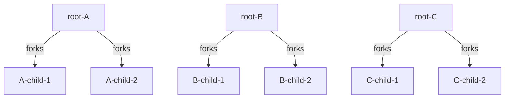

<!--
SPDX-FileCopyrightText: Copyright (c) 2025-2026 NVIDIA CORPORATION & AFFILIATES. All rights reserved.
SPDX-License-Identifier: Apache-2.0
-->

# DAG Benchmarks: Branching Conversations

Most benchmark conversations are a straight line: turn 1, then turn 2, then turn 3. DAG mode lets a single turn branch into **multiple follow-up conversations that run in parallel**. Picture a planner turn whose answer is then picked up by two different specialist turns at the same time, each continuing on its own from there.

This guide walks through the feature from zero: what it is, when to reach for it, and how to author a file. No prior AIPerf knowledge is assumed beyond the basics in the README.

## When to use DAG mode

Reach for DAG when your workload looks like one of these:

- **Prefix-cache or KV-aware routing tests.** You want several follow-up requests to share the same long preamble so the server's cache is exercised. DAG's **FORK** mode makes the children look like continuations of the parent and routes them all to the same worker.
- **Agentic sub-agent trees.** A parent turn completes, then independent sub-agents kick off. Each sub-agent should start fresh, not inherit the parent's history. DAG's **SPAWN** mode handles this.

If your workload is a plain sequence of turns with no branching, you do **not** need DAG — stick with `multi_turn` or `raw_payload`.

## The two branch modes

DAG mode exposes one primitive with two flavors, selected by a shorthand key on the parent turn:

| Mode | Shorthand on parent turn | What the child sees | Routing | Parent fate |
|---|---|---|---|---|
| **FORK** | `"forks": [...]` | Inherits the parent's full conversation history, including the captured model response. | Pinned to the same worker as the parent (locality). | Bare-string entries terminate; `{"child": ..., "background": true}` keeps the parent running. |
| **SPAWN** | `"spawns": [...]` | Starts from an empty history. Only the child's own messages go on the wire. | Free to land on any worker. | Continues; suspends only at an explicit `join_at` (or the next-turn auto-join). |

Both keys can appear on the same turn — the scheduler treats them independently, so one turn can both fork continuations and spawn fresh sub-agents.

## A minimal example, walked through

Below is the shipped example at `examples/dag_jsonl/example.dag.jsonl`. Each line is one conversation; the three conversations together describe one tree.

```jsonl
{"session_id":"root","turns":[{"model":"Qwen3-0.6B","messages":[{"role":"system","content":"You are a careful assistant."},{"role":"user","content":"Please summarize the attached document."}],"max_tokens":128,"forks":["branch-a","branch-b"]}]}
{"session_id":"branch-a","turns":[{"model":"Qwen3-0.6B","messages":[{"role":"user","content":"Expand on the first section in more detail."},{"role":"user","content":"Add a brief counter-argument."}],"max_tokens":96},{"model":"Qwen3-0.6B","messages":[{"role":"user","content":"Now tighten the expansion."},{"role":"user","content":"Keep the counter-argument intact."}],"max_tokens":64}]}
{"session_id":"branch-b","turns":[{"model":"Qwen3-0.6B","messages":[{"role":"user","content":"Point out weaknesses in the summary."}],"max_tokens":128},{"model":"Qwen3-0.6B","messages":[{"role":"user","content":"Fold the critique into a revised summary."}],"max_tokens":96}]}
```

Shape of the tree:



**Line 1 — `root`.** A single turn with a `system` and `user` message. Its `forks` list names two other conversations: when `root`'s first turn completes, AIPerf dispatches `branch-a` and `branch-b` concurrently.

**Line 2 — `branch-a`.** Two turns. Because it was reached via `forks`, it starts with `root`'s full accumulated history plus the real model response already in place. Its own messages get appended onto that, then dispatched.

**Line 3 — `branch-b`.** Also two turns, also forked from `root`. Runs in parallel with `branch-a` — both are sticky-routed to the same worker as `root`, so the server sees matching prefixes across the two siblings.

Run it against any OpenAI-compatible chat endpoint:

```bash
aiperf profile \
    --model Qwen3-0.6B \
    --endpoint-type chat \
    --streaming \
    --url localhost:8000 \
    --input-file examples/dag_jsonl/example.dag.jsonl \
    --custom-dataset-type dag_jsonl \
    --concurrency 1
```

The example file has exactly one root (`root`); `branch-a` and `branch-b` are FORK targets, not roots. The autodefault sets `--num-conversations` to the root count, so `--concurrency` may not exceed `1` here. To exercise concurrency, supply your own multi-root DAG file or pass `--num-conversations N` explicitly. (FORK fanout still produces multiple in-flight requests per session — see the "concurrency" reference section below.)

That is enough to get started. The rest of this document is reference material you can skim on demand.

---

## Reference: file format

Use `--custom-dataset-type dag_jsonl`. Each line of the input file is one conversation as a JSON object.

### Per-conversation shape

```jsonc
{
  "session_id": "root",          // required, unique across the file
  "turns": [ ... ],              // required, ordered, non-empty
  "pre_session_spawns": [ ... ]  // optional; child session ids (strings)
}
```

**`pre_session_spawns`** is a list of child session ids dispatched as background SPAWN branches **before** this conversation's turn 0 is issued. It exists for trace-timing fidelity: if a captured trace shows a sub-agent's first request overlapping with the parent's turn 0 in-flight window, the literal "spawn after parent turn completes" rule would shift the child later than the trace records. Listing the child here issues it ahead of turn 0 instead. These children are fire-and-forget; each gets a fresh correlation id with `parent_correlation_id=None`, so no SPAWN_JOIN gate can reference them. Pre-session children must be SPAWN-mode (no parent context to inherit) — referencing a session as a `pre_session_spawns` target while it is also a FORK target is rejected at load time.

### Per-turn shape

Each turn is a flat object validated against a strict schema (`DagTurn` in `src/aiperf/dataset/loader/dag_jsonl_models.py`). Top-level fields are limited to AIPerf-native Turn concepts plus DAG scheduling; every other OpenAI or vendor-specific parameter goes in `extra`, mirroring the CLI's `--extra-inputs` split. Unknown top-level keys are rejected at load time so typos surface immediately:

```jsonc
{
  // --- AIPerf-native Turn fields (top-level) ---
  "messages": [                              // required, non-empty; appended to the accumulator
    { "role": "system", "content": "..." },  // ONLY on root/seed turn (see below)
    { "role": "user",   "content": "..." }
  ],
  "model": "Qwen3-0.6B",      // optional; per-turn model override
  "max_tokens": 128,          // optional
  "tools": [ ... ],           // optional

  // --- everything else goes here ---
  "extra": {
    "temperature": 0.7,
    "top_p": 0.9,
    "seed": 42,
    "stop": ["\n\n"],
    "response_format": { "type": "json_schema", "json_schema": { ... } },
    "logprobs": true,
    "presence_penalty": 0.0,
    "frequency_penalty": 0.0,
    "ignore_eos": true,       // vendor-specific (vLLM, TRT-LLM, SGLang)
    "min_tokens": 50          // vendor-specific
  },

  // --- structural DAG fields (not sent on the wire) ---
  "forks":  ["child-id-1", "child-id-2"],  // FORK-mode children (inherit parent context)
  "spawns": [                               // SPAWN-mode children (fresh context)
    "agent-c",                              //   bare string: auto-join on next turn
    { "children": ["agent-d"], "join_at": 4 }  // object form: parent runs intermediate
                                            //   turns concurrently, gates at join_at
  ],
  "delay":  0.0                             // milliseconds to wait before dispatching this turn
}
```

`spawns` entries may be plain strings or `DagSpawn` objects (`{"children": [...], "join_at": <turn_index>}`). A bare string `"x"` is shorthand for `{"children": ["x"], "join_at": <spawn_turn> + 1}` — the parent suspends immediately on the next turn. The object form lets the parent run turns `[spawn_turn+1 .. join_at-1]` concurrently with the spawned children, then gates on `join_at`. `join_at` must be strictly greater than the spawning turn index and less than the conversation's total turn count.

**Native vs. extra.** The top-level whitelist matches AIPerf's native `Turn` concepts (`messages`, `model`, `max_tokens`, `tools`) — the same fields AIPerf already tracks per-turn for any dataset. Anything else — sampling knobs (`temperature`, `top_p`, `seed`, `stop`, `logprobs`), response shaping (`response_format`), vendor tunables (`ignore_eos`, `min_tokens`, `top_k`) — lives in `extra`. At dispatch time the `extra` keys are merged into the top level of the wire body, so name them exactly as the server expects.

**What gets sent on the wire.** Structural keys (`forks`, `spawns`, `delay`) are consumed by the scheduler; every native field and everything under `extra` is forwarded to the chat-completions request body.

**Message shape.** Each entry in `messages` is a free-form dict — the only structural requirement is a `role` key, matching `MooncakeTrace`. `content` may be a string, a list of OpenAI multimodal parts (e.g. `[{"type": "text", "text": "..."}, {"type": "image_url", "image_url": {"url": "..."}}]`), or omitted for assistant messages that are purely `tool_calls`. Paste whatever the server expects; AIPerf forwards it verbatim onto the wire.

### FORK mode (prefix-cache testing)

`forks: [session_id, ...]` desugars into FORK-mode branches. When the parent turn completes, each listed child session:

- Inherits the parent's accumulated message history (including the captured real assistant response), merged under the system-prompt rule below.
- Sticky-routes to the parent's worker so the server sees sibling requests with a common prefix and can exercise its prefix cache.

Each listed `session_id` must be declared as its own top-level conversation in the same file. A conversation can be the FORK target of **at most one** parent (ambiguous seed messages otherwise). See [Join Semantics](#join-semantics) below for how a parent can gate a later turn on its FORK/SPAWN children completing.

By default a bare-string `forks: ["c"]` entry is **terminal**: the parent has no further turns after the fork dispatches, and the loader rejects bare-string `forks:` on any non-final turn. Use the object form `{"child": "c", "background": true}` when the parent should keep running its remaining turns while the forked child fans out — see "FORK mode with `background: true`" below.

#### What the child sees in the inherited context

The seed history a FORK child inherits is the parent's `messages` plus the captured assistant reply, with two intentional simplifications:

- **`reasoning` is dropped from the captured assistant turn.** The endpoint's `build_assistant_turn` keeps `content` (and tool/function calls when present) but discards `reasoning_content`/`reasoning` because most chat templates do not round-trip reasoning back to the model on a follow-up. Only the `content` field of a `ReasoningResponseData` survives into the child's seed; if the parent emitted reasoning *only* (empty `content`), the reasoning text is used as a fallback so the child still sees something. For workloads where chain-of-thought continuity across turns matters, prefer SPAWN mode — its children start fresh with the same `system` prompt rather than inheriting an inevitably-stripped CoT.
- **Responses-API output items that are server-built tool outputs are filtered.** When the parent runs against `endpoint=responses` and the model emitted `web_search_call`, `file_search_call`, `image_generation_call`, `code_interpreter_call`, `computer_call`, or `reasoning` items, those are stripped from the seed before splicing into the child's `input` array — the Responses API rejects them as input unless paired with the corresponding tool config, which the child does not redeclare. `message` and `function_call` items round-trip cleanly and remain.

### FORK mode with `background: true` (fork-and-continue)

```json
{
  "messages": [...],
  "forks": [{"child": "subagent", "background": true}]
}
```

A `DagFork` entry with `background: true` is the inherit-context-AND-parent-continues variant of FORK. Use it when a parent should hand off context to a child that runs in the background while the parent keeps having its conversation. Common pattern: the parent is the user-facing agent thread; the child is a tool-call or sub-agent that needs the full history-to-date but doesn't gate the parent's reply.

| Property | bare `forks: ["c"]` | `forks: [{"child": "c", "background": true}]` |
|---|---|---|
| Child inherits parent context | yes | yes |
| Sticky-routing to parent worker | yes | yes |
| Parent's remaining turns | not allowed (must be terminal) | run normally |
| Join semantics | n/a (parent terminates) | none (fire-and-forget) |
| Allowed on non-final turns | no | yes |

Multiple `background: true` entries on the same turn collapse into one branch with all children fanning out together (mirroring how bare-string `forks: ["c1", "c2"]` collapses). Mixing bare-string and `background: true` on the same turn is allowed only on the terminal turn — bare-string would terminate the parent, contradicting the BG entry's "parent continues" intent on a non-final turn.

The runtime path is identical to plain FORK except that no `SPAWN_JOIN` prerequisite is generated, so the parent never suspends for the child. If the parent finishes before the child, the child runs to completion under the existing `--request-count` and cancellation gates; nothing in the run waits for the child specifically.

For agentic patterns where the parent eventually needs the child's result before continuing — true synchronous tool-call semantics — use SPAWN with an explicit `join_at` instead. (Inheriting context AND joining at a specific turn — i.e. `DagFork.join_at` — is a planned extension, not in v1.)

### SPAWN mode (agentic sub-agents)

`spawns: [session_id, ...]` desugars into SPAWN-mode branches. When the parent turn completes, each listed child session:

- Starts with an **empty** accumulator — only its own `messages` go on the wire.
- Routes freely (no sticky pin to the parent's worker).

SPAWN targets may be referenced from multiple parents — the child conversation is effectively a fresh-context template. Use SPAWN when you're benchmarking agent-tree shapes where each sub-agent is semantically independent, not a continuation of the parent.

### Join semantics

DAG-style conversations can declare that a turn dispatches only after children from a prior SPAWN branch complete. Gating is declared via a `TurnPrerequisite(kind=SPAWN_JOIN, branch_id=...)` on the *consuming* turn rather than on the spawning branch. The runtime builds a `(conversation_id, branch_id) -> gated_turn_index` index at phase init; when `BranchOrchestrator.intercept()` sees a spawning turn complete, it resolves the gate from the index and suspends the parent until every outstanding child drains. `CreditIssuer.dispatch_join_turn` then issues the parent's gated turn — reusing the parent's already-held session slot (the gated turn has `turn_index > 0`, so session-slot acquisition is naturally skipped).

For v1, the orchestrator honors these gate shapes:

- **FORK**: no gate; child inherits parent context and sticky-routes.
- **SPAWN, immediate join (legacy bare-string form)**: parent suspends on the turn immediately after the spawning turn (`join_at = spawn_turn + 1`).
- **SPAWN, delayed join (`DagSpawn.join_at = K`)**: busy-parent semantics. The parent runs turns `[spawn_turn+1 .. K-1]` concurrently with the spawned children and only suspends when it is about to dispatch turn `K`.
- **SPAWN, fan-in (multiple branches gating one turn)**: a single gated turn may carry SPAWN_JOIN prereqs referencing multiple branches (across one or more spawning turns); the orchestrator pre-seeds an `outstanding` set and only fires when every referenced branch drains. Multi-consumer is also supported — one branch_id may be gated by prereqs on more than one downstream turn.
- **Pre-session SPAWN (`pre_session_spawns`)**: parent does not wait; the child runs fire-and-forget and may not be the target of a SPAWN_JOIN.

Constructs **not yet honored** by the orchestrator — per-child gates (`child_conversation_ids` subsets), runtime-diamond barriers (`barrier_id`), timer-based prereqs (`timer_seconds`), and external-event prereqs (`event_name`) — are accepted by the datastructures but raise `NotImplementedError` from `validate_for_orchestrator_v1` at load time.

### Mixing modes

Both shorthands may appear on the same turn. The loader disambiguates the generated `branch_id`s by appending `:fork` / `:spawn` suffixes in that case; when only one shorthand is present, the simple `<session_id>:<turn_index>` form is used. Example:

```jsonc
{
  "messages": [ ... ],
  "forks":  ["continuation-a"],
  "spawns": ["critic", "verifier"]
}
```

### `max_tokens` and other OpenAI fields

`max_tokens`, `model`, and `tools` are AIPerf-native Turn fields and sit at the top level of the turn. For any other OpenAI chat-completions parameter — `temperature`, `top_p`, `seed`, `stop`, `response_format`, `logprobs`, etc. — put it in `extra`. Vendor-specific knobs (`ignore_eos`, `min_tokens`, `top_k`, …) go in the same place and are merged into the top level of the wire body at dispatch time, matching the CLI's `--extra-inputs` convention.

## Reference: accumulation semantics (pure append)

DAG mode uses AIPerf's standard `DELTAS_WITHOUT_RESPONSES` context mode: each turn's `messages` is appended onto the session's `turn_list`, and after the response arrives AIPerf appends a captured `{role: assistant, content: <response_text>}` Turn for the next turn to see. The chat endpoint walks `turn_list` at dispatch time and concatenates every turn's messages into the wire body — so the merge is pure concatenation. No role inspection, no system-prompt rewriting, no deduplication.

Concretely, for a FORK child's first turn:

```text
accumulated (seeded from FORK parent): [root sys, root user, root assistant_response]
incoming (this turn):                  [child user_a, child user_b]

Wire payload messages:
  [root sys, root user, root assistant_response, child user_a, child user_b]
```

### Authoring rule: one `system` per conversation root

Because the merge is pure concatenation, any `system` entry on a non-root turn lands at position > 0 in the wire payload. Popular chat templates ignore system messages after index 0, so a mis-placed system entry silently disappears — a benchmarking footgun large enough that the loader rejects it.

`system` entries are permitted only on the **accumulator-seeding turn**:

- The root conversation's turn 0.
- A SPAWN child's turn 0 (SPAWN children start from an empty accumulator).

A FORK child's turn 0 is **not** a root — it inherits the parent's accumulator (which already carries the root's system prompt), so any `system` entry there would be appended after that existing one and dropped by the chat template. The loader raises on such files at load time.

If you need each phase to wrap the previous response with a new "system-like" framing, author that framing as a `user` message.

## Reference: routing and `agent_depth`

Every AIPerf session has its own `x_correlation_id` that pins it to a specific worker via sticky routing. In a DAG, FORK children inherit their parent's routing key: the router keys on the root session's correlation id, not each child's. That means:

- All siblings in a fork hit the **same worker** as the parent.
- Siblings send the same root prefix, so the worker (and its server) see a clean prefix-cache hit pattern across sibling pairs.

This is what makes FORK mode useful for exercising prefix-cache and KV-aware routing — without sticky routing across the fork, siblings would scatter across workers and the prefix-share benefit would be invisible on the server.

Every credit and request record is tagged with two DAG-aware fields:

- **`agent_depth`** (`int`) — `0` for root sessions, `1` for direct children, `2` for grandchildren, etc. Roots flowing through a non-DAG dataset all carry `agent_depth=0`, so post-hoc analysis can filter on this field to compare root-only vs full-tree throughput without re-running the benchmark.
- **`parent_correlation_id`** (`str | None`) — the correlation id of the immediate parent session, or `None` for roots and pre-session SPAWN children (which start fresh with no parent gating). FORK and ordinary SPAWN children both carry the spawning parent's correlation id, distinguishing "this request belongs to a fork tree" from "this is an independent sub-agent dispatch".

## Reference: concurrency (fanout exceeds session slots)

Children do **not** acquire fresh session slots — they inherit the root session's slot. This keeps slot accounting sane across arbitrarily deep DAGs, but it has a user-visible consequence:

> At a fork point, in-flight request count can temporarily exceed the configured session concurrency by the fanout factor. A root with `forks: [A, B, C]` and concurrency=10 will briefly show up to **30** in-flight requests while the three children are concurrently running.

If you are using `--concurrency` as a hard cap to protect a fragile server, size it with the fanout factor in mind, or keep your DAG tree shallow. Metrics are still tagged per-session (`agent_depth`, `parent_correlation_id`), so post-hoc analysis can distinguish root vs child load.

## Reference: stop conditions for DAG children

Children are dispatched reactively by `BranchOrchestrator` at credit-return time, not by the phase's `TimingStrategy` loop, and do not consume entries from the `DatasetSampler`. Their stop-condition behavior splits by intent:

- **`--request-count` (`RequestCountStopCondition`): HONORED for children.** It is a literal wire-request cap and applies to every credit on the wire. When the cap fires mid-tree, an in-flight child's remaining turns will be elided — `BranchStats.children_truncated` records the child, and `BranchStats.joins_suppressed` counts any parent join that was released without firing because the gated child was capped. Cancellation and duration timeouts honor the same rule.
- **`--num-conversations` (`SessionCountStopCondition`): BYPASSED for children.** It targets sampler-plan completion ("run N full conversations") — children belong to a conversation tree and should run as part of their parent's session, not be truncated mid-tree. The wire-cap intent is served by `--request-count` instead.

### `--num-conversations` autodefault for `dag_jsonl`

When neither `--request-count` nor `--num-conversations` is supplied for a `dag_jsonl` run, AIPerf auto-defaults `--num-conversations` to the **root count** of the file (sessions not referenced by any other conversation's `forks` list) rather than auto-defaulting `--request-count`. Auto-defaulting `--request-count` for a forking dataset would silently truncate the DAG mid-tree because the cap counts fork-spawned children. The CLI logs:

```
No request count or conversation count provided for forking dataset;
defaulting --num-conversations to N (run each root in the file once).
Use --request-count for a literal wire-request cap instead.
```

If you do want a wire-request cap, pass `--request-count` explicitly — but be aware of the cap-applies-to-children behavior described above.

## Reference: runtime walkthrough

Using the example file above, here is what happens on the wire:

1. `root`'s turn 0 dispatches as-is (accumulator is empty, so walking `turn_list` yields just the authored system + user).
2. When its response arrives, the worker appends a captured `{role: assistant, content: <real_text>}` Turn onto `root.turn_list`.
3. The orchestrator sees `forks=["branch-a","branch-b"]` and sticky-routes both children to `root`'s worker; at the worker, `UserSessionManager.create_and_store` seeds each child's `turn_list` from the parent session's accumulator. Both children's turn 0 then dispatch concurrently.
4. `branch-a`'s turn 0 has its authored `raw_messages` appended into the child's `turn_list`; the chat endpoint walks the list and concatenates every turn's messages, producing `[root sys, root user, root assistant_response, child user_a, child user_b]`. No system-prompt rewriting happens — accumulation is pure concatenation.
5. `branch-a`'s turn 1 follows the same rule, now on top of the captured response from turn 0.
6. `branch-b` runs concurrently with `branch-a`, independently.
7. `root` has no further turns, so it terminates at the fork point. Its session is pinned in the worker cache (declared DAG branches) so late-arriving siblings can still seed their `turn_list` from it.

## Reference: validation and error messages

The loader performs strict structural checks at load time. Every error message includes the offending `file:line`.

| Failure | Example message |
|---|---|
| Invalid JSON on a line | `line 3: invalid JSON: ...` |
| Missing `session_id` | `line 3: session_id: Field required` |
| Duplicate `session_id` | `line 7: duplicate session_id 'branch-a'` |
| Missing/empty `turns` | `line 3: turns: List should have at least 1 item after validation, not 0` |
| Turn missing `messages` | `line 3: turns.0.messages: Field required` |
| `messages` not a list | `line 3: turns.0.messages: Input should be a valid list` |
| Unknown top-level turn key | `line 3: turns.0.max_token: Extra inputs are not permitted` |
| Unknown top-level conversation key | `line 3: not_a_real_field: Extra inputs are not permitted` |
| Invalid message role | `line 3: turns.0: Value error, Each message must have a 'role' key, but message at index 0 does not` |
| `system` on non-root turn | `session 'branch-a' turn 0: non-root turns may not contain a 'system' message. ...` |
| Unresolved fork target | `session 'root' turn 0: branch target 'brnch-a' not declared. Known sessions: [...]` |
| Cycle | `cycle detected: A -> B -> A` (hard error) |
| Multiple FORK parents for a session | `session 'Y' forked by both 'A' turn 0 and 'B' turn 0; FORK-mode children require a single parent` |
| Fork on non-terminal turn without a join | `session 'X' turn 0 has foreground FORK branches but is not the last turn and no join is declared` |
| `pre_session_spawns` target also FORK-targeted | `session 'Y' is referenced by 'X' pre_session_spawns but is also a FORK target; pre-session children must be SPAWN-mode` |

Cycles are a hard error because they guarantee infinite recursion.

## Reference: BranchStats output schema

Every DAG-shaped run publishes a `BranchStats` snapshot per credit phase, exported under `branch_stats` in `profile_export_aiperf.json`:

```jsonc
{
  "branch_stats": {
    "children_spawned":                   12,  // FORK + SPAWN children dispatched
    "children_completed":                 11,  // children that reached their leaf turn
    "children_errored":                    0,  // children that terminated with an error
    "children_truncated":                  1,  // children stopped mid-tree by --request-count
    "parents_suspended":                   3,  // parents that paused awaiting a join
    "parents_resumed":                     3,  // parents that resumed after all children drained
    "parents_failed_due_to_child_error":   0,  // parents aborted under AIPERF_DAG_FAIL_FAST=1
    "joins_suppressed":                    0   // joins released without firing because the
                                               // gated child was blocked by a stop condition
  }
}
```

Counters are mode-agnostic (the same shape applies to FORK-only, SPAWN-only, and mixed runs). Use `children_truncated` and `joins_suppressed` to detect when a `--request-count` cap interrupted the DAG mid-tree; they tally separately from `children_completed` so observability stays accurate. Linear (non-DAG) runs leave `branch_stats` unset on `ProfileResults`.

## Reference: environment variables

- `AIPERF_DAG_FAIL_FAST` (default `false`): when `true`, the first DAG child error aborts the whole run — pending siblings are cancelled, the error raises to `PhaseRunner`, and the phase terminates. Default `false`: the orchestrator counts the error in `BranchStats.children_errored`, releases the join slot, drains pending siblings, and continues the run. Set to `1` for strict CI assertions.

## Reference: worked example with multiple roots

A three-root file that exercises FORK fanout from each root:

```jsonl
{"session_id":"root-A","turns":[{"messages":[{"role":"user","content":"plan task"}],"forks":["A-child-1","A-child-2"]}]}
{"session_id":"A-child-1","turns":[{"messages":[{"role":"user","content":"detail option 1"}]}]}
{"session_id":"A-child-2","turns":[{"messages":[{"role":"user","content":"detail option 2"}]}]}
{"session_id":"root-B","turns":[{"messages":[{"role":"user","content":"plan task"}],"forks":["B-child-1","B-child-2"]}]}
{"session_id":"B-child-1","turns":[{"messages":[{"role":"user","content":"detail option 1"}]}]}
{"session_id":"B-child-2","turns":[{"messages":[{"role":"user","content":"detail option 2"}]}]}
{"session_id":"root-C","turns":[{"messages":[{"role":"user","content":"plan task"}],"forks":["C-child-1","C-child-2"]}]}
{"session_id":"C-child-1","turns":[{"messages":[{"role":"user","content":"detail option 1"}]}]}
{"session_id":"C-child-2","turns":[{"messages":[{"role":"user","content":"detail option 2"}]}]}
```

Topology:



Run with the autodefault:

```bash
aiperf profile \
    --model Qwen3-0.6B \
    --endpoint-type chat \
    --url localhost:8000 \
    --input-file three-roots.dag.jsonl \
    --custom-dataset-type dag_jsonl \
    --concurrency 3
```

With neither `--num-conversations` nor `--request-count` supplied, AIPerf logs `defaulting --num-conversations to 3` (one per root). The wire sees exactly nine requests: three roots and six children. `BranchStats.children_spawned` will be `6`, `children_completed` will be `6`, and all other counters will be `0`.

## When NOT to use DAG mode

- **Linear multi-turn conversations** — use `multi_turn` or `raw_payload`. DAG is overkill if there is no fork.
- **Pre-built traces with timestamps** — use `mooncake_trace` with `--fixed-schedule`. DAG mode does not currently support per-turn timestamps.
- **Synthetic prompt generation** — DAG mode takes authored turn objects as given (messages are appended to the accumulator as-is). There is no synthetic input generator in v1.
- **Diamond topologies** — a session with two FORK parents is explicitly rejected. DAG mode ships tree topology only.

## Related docs

- [Raw Payload Replay](../tutorials/raw-payload-replay.md) — the non-forking analogue.
- [Multi-Turn Conversations](../tutorials/multi-turn.md) — linear multi-turn replay.
- [Architecture](../architecture.md) — sub-agent orchestrator and credit plumbing.
- [Conversation Context Mode](../reference/conversation-context-mode.md) — background on how history accumulates.
