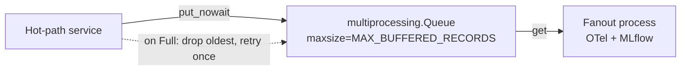

# AIPerf Code Patterns

Code examples for common development tasks. Referenced from CLAUDE.md.

## CLI Command Pattern

Commands live in `src/aiperf/cli_commands/`, one file per command. They are
lazily loaded via import strings in `aiperf.cli` — modules are only imported
when their command is invoked:

```python
# aiperf/cli.py — register with lazy import strings
app.command("aiperf.cli_commands.profile:app", name="profile")
```

```python
# aiperf/cli_commands/profile.py — thin command definition
from cyclopts import App
from aiperf.common.config import ServiceConfig, UserConfig

app = App(name="profile")

@app.default
def profile(user_config: UserConfig, service_config: ServiceConfig | None = None) -> None:
    """Run the Profile subcommand."""
    from aiperf.cli_runner import run_system_controller  # heavy import deferred

    run_system_controller(user_config, service_config)
```

**Conventions:**
- Export a single `App` named `app`.
- Hyphenate multi-word commands: `App(name="analyze-trace")`.
- Keep module-level imports minimal; heavy deps go inside the function body.
- Heavy implementation logic lives in a `cli.py` inside the owning domain
  package (e.g. `aiperf/plugin/cli.py`), lazily imported at call time.

## Service Pattern

Services run in separate processes via `bootstrap.py`:

```python
class MyService(BaseComponentService):
    @on_message(MessageType.MY_MSG)
    async def _handle(self, msg: MyMsg) -> None:
        await self.publish(ResponseMsg(data=msg.data))
```

Register in `plugins.yaml`:

```yaml
service:
  my_service:
    class: aiperf.my_module.my_service:MyService
    description: My custom service
    metadata:
      required: true
      auto_start: true
```

**Config types:**
- `ServiceConfig`: infrastructure (ZMQ ports, logging level)
- `UserConfig`: benchmark params (endpoints, loadgen settings)

## Model Pattern

Use `AIPerfBaseModel` for data, `BaseConfig` for configuration:

```python
from pydantic import Field
from aiperf.common.models import AIPerfBaseModel

class Record(AIPerfBaseModel):
    ts_ns: int = Field(description="Timestamp in nanoseconds")
    value: float = Field(description="Measured value")
```

## Message Pattern

Messages require `message_type` field and handler decorator:

```python
from aiperf.common.messages import Message
from aiperf.common.hooks import on_message

class MyMsg(Message):
    message_type: MessageType = MessageType.MY_MSG
    data: list[Record] = Field(description="Records to process")

# In service class:
@on_message(MessageType.MY_MSG)
async def _handle(self, msg: MyMsg) -> None:
    await self.publish(OtherMsg(data=msg.data))
```

Auto-subscription happens during `@on_init` phase.

## Plugin System Pattern

YAML-based registry with lazy-loading:

```yaml
# plugins.yaml
endpoint:
  chat:
    class: aiperf.endpoints.openai_chat:ChatEndpoint
    description: OpenAI Chat Completions endpoint
    metadata:
      endpoint_path: /v1/chat/completions
      supports_streaming: true
      produces_tokens: true
      tokenizes_input: true
      supports_audio: true
      supports_images: true
      supports_videos: true
      metrics_title: LLM Metrics
```

```python
from aiperf.plugin import plugins
from aiperf.plugin.enums import PluginType

EndpointClass = plugins.get_class(PluginType.ENDPOINT, 'chat')
```

## Error Handling Pattern

Log errors and publish `ErrorDetails` in messages:

```python
try:
    await risky_operation()
except Exception as e:
    self.error(f"Operation failed: {e!r}")
    await self.publish(ResultMsg(error=ErrorDetails.from_exception(e)))
```

## Logging Pattern

Use lambda for expensive log messages:

```python
# Expensive - lambda defers evaluation
self.debug(lambda: f"Processing {len(self._items())} items")

# Cheap - direct string is fine
self.info("Starting service")
```

## Testing Pattern

```python
import pytest
from aiperf.plugin import plugins
from aiperf.plugin.enums import PluginType
from tests.harness import mock_plugin

@pytest.mark.asyncio
async def test_async_operation():
    result = await some_async_func()
    assert result.status == "ok"

@pytest.mark.parametrize("input,expected",
    [
        ("a", 1),
        ("b", 2),
    ]
)  # fmt: skip
def test_with_params(input, expected):
    assert process(input) == expected

def test_with_mock_plugin():
    with mock_plugin(PluginType.ENDPOINT, "test", MockClass):
        assert plugins.get_class(PluginType.ENDPOINT, "test") == MockClass
```

**Auto-fixtures** (always active): asyncio.sleep runs instantly, RNG=42, singletons reset.

## Console Exporter Pattern

Console exporters subclass `ConsoleMetricsExporter` and configure rendering via class attributes — no method overrides required for the common case. The base class handles filtering, grouping, table construction, and printing; subclasses just declare what to show and when to run.

```python
# src/aiperf/exporters/internal_metrics_console_exporter.py — gated single-table
class ConsoleInternalMetricsExporter(ConsoleMetricsExporter):
    """Console exporter for INTERNAL framework metrics, gated on dev mode."""

    title = "[yellow]NVIDIA AIPerf | Internal Metrics[/yellow]"
    require_flags = MetricFlags.INTERNAL    # records must have this flag
    exclude_flags = MetricFlags.ERROR_ONLY  # records with this flag are hidden
    console_groups = None                   # single combined table; ignore groups

    def _check_enabled(self, exporter_config: ExporterConfig) -> None:
        if not (Environment.DEV.MODE and Environment.DEV.SHOW_INTERNAL_METRICS):
            raise ConsoleExporterDisabled("Internal metrics are not enabled, ...")
```

| Class attribute  | Type                                     | Purpose                                                                                  |
|------------------|------------------------------------------|------------------------------------------------------------------------------------------|
| `title`          | `str | None`                             | Static title; `None` derives from endpoint metadata.                                     |
| `require_flags`  | `MetricFlags`                            | Records must have ALL of these. Default `MetricFlags.NONE` (no requirement).             |
| `exclude_flags`  | `MetricFlags`                            | Records with ANY of these are hidden. Default `ERROR_ONLY | INTERNAL | EXPERIMENTAL`.    |
| `console_groups` | `tuple[MetricConsoleGroup, ...] | None`  | Groups to include, in render order. `None` disables group filtering (single table).      |
| `split_by_group` | `bool`                                   | `True` → one table per non-empty group. `False` → single combined table.                 |

Override `_check_enabled(self, exporter_config)` to raise `ConsoleExporterDisabled` when the exporter shouldn’t run (env var, user-config flag, dev mode). The base class no-ops (always-enabled). The flag-driven sibling exporters (`ConsoleInternalMetricsExporter`, `ConsoleExperimentalMetricsExporter`, `HttpTraceConsoleExporter`) follow this pattern verbatim — copy one of them as a starting point.

## Uncertainty Plot Pattern

The latency-throughput uncertainty plot uses a one-data-contract, three-renderers architecture.

### Data Contract

```python
from aiperf.plot.models.uncertainty import BenchmarkPoint, LatencyThroughputUncertaintyData

point = BenchmarkPoint(
    x_mean=10.0, y_mean=100.0,
    x_ci_low=8.0, x_ci_high=12.0,
    y_ci_low=90.0, y_ci_high=110.0,
    cov_xy=5.0,  # enables rotated ellipses; None for axis-aligned
    label="concurrency=4",
)
data = LatencyThroughputUncertaintyData(
    points=[point],
    confidence_level=0.95,
    title="Latency vs Throughput",
    x_label="Latency (ms)",
    y_label="Throughput (tok/s)",
)
```

### Multi-Series Data Contract

```python
from aiperf.plot.models.uncertainty import (
    BenchmarkPoint, LatencyThroughputUncertaintyData, UncertaintySeries,
)

# One series per experiment variant (e.g., request_count=20 vs 50).
# When `series` is non-empty it overrides `points`; see get_series().
data = LatencyThroughputUncertaintyData(
    series=[
        UncertaintySeries(name="request_count=20", points=[
            BenchmarkPoint(x_mean=5.0, y_mean=50.0, x_ci_low=4.0, x_ci_high=6.0,
                           y_ci_low=45.0, y_ci_high=55.0, label="c=2", n_runs=10),
            BenchmarkPoint(x_mean=15.0, y_mean=120.0, x_ci_low=13.0, x_ci_high=17.0,
                           y_ci_low=110.0, y_ci_high=130.0, label="c=10", n_runs=8),
        ]),
        UncertaintySeries(name="request_count=50", points=[
            BenchmarkPoint(x_mean=6.0, y_mean=48.0, x_ci_low=4.5, x_ci_high=7.5,
                           y_ci_low=42.0, y_ci_high=54.0, label="c=2", n_runs=10),
            BenchmarkPoint(x_mean=18.0, y_mean=110.0, x_ci_low=15.0, x_ci_high=21.0,
                           y_ci_low=100.0, y_ci_high=120.0, label="c=10", n_runs=10),
        ]),
    ],
    confidence_level=0.95,
    title="Latency vs Throughput by Request Count",
    x_label="Latency (ms)",
    y_label="Throughput (tok/s)",
)
```

### Plotly Renderer (interactive + Kaleido PNG)

```python
from aiperf.plot.core.plot_generator import PlotGenerator

pg = PlotGenerator()
fig = pg.create_uncertainty_plot(data)
fig.write_image("output.png")  # Kaleido export
```

### Matplotlib Renderer (code-gen reports)

```python
from aiperf.plot.exporters import export_uncertainty_matplotlib
from pathlib import Path

export_uncertainty_matplotlib(data, Path("output.png"))
```

### Ellipse Geometry Utility

```python
from aiperf.plot.geometry import compute_ellipse_vertices, compute_axis_aligned_ellipse_vertices
import numpy as np

cov = np.array([[4.0, 1.0], [1.0, 9.0]])
vertices = compute_ellipse_vertices(cov, center=(10.0, 100.0), confidence_level=0.95)
# Returns list of (x, y) tuples forming a closed polygon
```

## Strategy Protocol Pattern

The OTel results processor uses a strategy protocol to dispatch incoming data
to specialised handlers. Each strategy declares what data it supports and
processes matching records independently:

```python
from typing import Protocol, runtime_checkable

from aiperf.common.messages.inference_messages import MetricRecordsData
from aiperf.common.models import CreditPhaseStats

OTelResultData = MetricRecordsData | CreditPhaseStats


@runtime_checkable
class OTelResultsStrategyProtocol(Protocol):
    """Public extension point for new streamed OTel result domains.

    A strategy owns exactly one ``OTelResultData`` variant and emits its
    telemetry via ``OTelStrategyContextProtocol``. Strategies MUST NOT touch
    OTel instruments, the fanout queue, or the MLflow client directly — the
    context owns instrument lifecycle and cross-strategy state so fanout
    stays consistent across strategies.
    """

    def supports(self, record_data: OTelResultData) -> bool:
        """Return True iff ``record_data`` is the variant this strategy consumes.

        Implementations use ``isinstance`` against a single concrete type —
        strategies are mutually exclusive by record type.
        """
        ...

    async def process(self, record_data: OTelResultData) -> None:
        """Emit telemetry for ``record_data`` without blocking the hot path.

        Instrument access goes through the context's ``get_or_create_*``
        factories, which enqueue fanout events rather than touching the OTel
        SDK inline. Raising is permitted; the processor is best-effort, so
        the records manager logs and swallows the failure.
        """
        ...
```

Concrete strategies accept a context object at construction time and implement
the two-method interface:

```python
from aiperf.post_processors.strategies.core import (
    OTelResultData,
    OTelResultsStrategyProtocol,
    OTelStrategyContextProtocol,
)


class MetricResultsStrategy(OTelResultsStrategyProtocol):
    """Streams per-request metric records as histogram observations."""

    def __init__(self, context: OTelStrategyContextProtocol) -> None:
        self._context = context

    def supports(self, record_data: OTelResultData) -> bool:
        return isinstance(record_data, MetricRecordsData)

    async def process(self, record_data: OTelResultData) -> None:
        # Emit histogram observations for each metric in the record.
        ...


class TimingResultsStrategy(OTelResultsStrategyProtocol):
    """Streams phase-level timing snapshots using counters and gauges."""

    def __init__(self, context: OTelStrategyContextProtocol) -> None:
        self._context = context

    def supports(self, record_data: OTelResultData) -> bool:
        return isinstance(record_data, CreditPhaseStats)

    async def process(self, record_data: OTelResultData) -> None:
        # Emit counter deltas and gauge snapshots for timing data.
        ...
```

The processor iterates registered strategies on each incoming record:

```python
for strategy in self._strategies:
    if strategy.supports(record_data):
        await strategy.process(record_data)
```

**Conventions:**
- One strategy class per file under `post_processors/strategies/`.
- `supports()` uses `isinstance` checks — no dynamic dispatch tables.
- `OTelStrategyContextProtocol` exposes instrument factories (`get_or_create_histogram`, etc.) so strategies never construct OTel instruments directly.

## Drop-Oldest Fanout Queue

`OTelMetricsResultsProcessor` fans out metric events to a dedicated child
process via a bounded `multiprocessing.Queue`. The queue uses drop-oldest
semantics so the hot path (the main benchmark loop) is never blocked by a slow
downstream consumer.



**Queue sizing:**

```python
import multiprocessing as mp
from aiperf.common.config import Environment

event_queue = mp.Queue(maxsize=Environment.OTEL.MAX_BUFFERED_RECORDS)  # default 10 000
```

**Backpressure algorithm:**

1. Attempt `queue.put_nowait(event)`.
2. On `queue.Full`, call `queue.get_nowait()` to discard the oldest event.
3. Retry `queue.put_nowait(event)` once.
4. If the retry also fails, increment `_fanout_dropped_events` and log at
   thresholds (1, 100, 1 000 drops).

```python
from queue import Empty, Full

def _queue_fanout_event(self, event_type: str, payload: dict[str, Any]) -> None:
    """Enqueue streaming event for the fanout process without blocking the event loop."""
    if self._fanout_queue is None:
        return

    event = {"type": event_type, "payload": payload}
    try:
        self._fanout_queue.put_nowait(event)
        self._fanout_sent_events += 1
    except Full:
        if self._drop_oldest_fanout_event():
            try:
                self._fanout_queue.put_nowait(event)
                self._fanout_sent_events += 1
                return
            except Full:
                pass
        self._record_fanout_drop(
            "OTel fanout queue remained full; dropping newest event"
        )
    except Exception as exc:
        self.warning(f"Failed to enqueue OTel fanout event: {exc!r}")
```

**Design rationale:**
- The benchmark hot path must never block on telemetry I/O.
- Dropping the oldest event (rather than the newest) preserves the most recent
  state, which is more useful for live dashboards.
- The counter `_fanout_dropped_events` is reported at shutdown so operators can
  tune `AIPERF_OTEL_MAX_BUFFERED_RECORDS` if drops are frequent.
